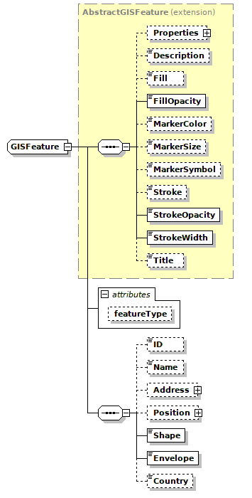

# lib-gis-dto

**GIS Data Transfer Objects**

A _Data Transfer Object_ is an object that is used to encapsulate data and send
it from one subsystem of an application to another.

DTOs are most commonly used by the Services layer in an N-Tier application to transfer data between itself and the UI layer. In a distributed application a DTO provides a convenient, neutral message container that does not impose any design constraint on the receiving system.

The main benefit of a DTO is reducing the amount of data that must be exchanged in distributed applications. They also make great models in the MVC pattern.
A DTO is a dumb object - it just holds properties and has getters and setters, but no other logic of any significance (other than maybe a compare() or equals() implementation).

This library provide the following DTO classes:

  *  **GISFeatureCollection** - a collection of features
  *  **GISFeature** - a feature
  *  **GISAddress** - a fully qualified (mailing) address
  *  **GISPosition** - a fully qualified geographic position
  *  **GISImage** - describes a map image overlay
  *  **AbstractGISFeature** - provides support for map styles and other properties

This library provides the following utility classes (in the `io` directory)

  *  **GeoJSONWriter** - transform GIS DTO instances to **GeoJSON**
  *  **KmlReader** - transform KML files to GIS DTO instances
  *  **KmlWriter** - transform GIS DTO instances to a **KML** document

# Uses

Key Bridge uses this the DTO classes in this library in our GIS API.
See the `io` utility classes or unit tests for usage examples.

# References

 * [GIS DTO v1.4.0](docs/xsd/gis-dto.2018-05-08.xsd)  XML Schema Document
 * [Data Transfer Object](https://martinfowler.com/eaaCatalog/dataTransferObject.html)

# License

Copyright 2017-2018 Key Bridge. License is **Apache 2.0**.

# History

    v1.0.0 - migrated from keybridge-common to gis-common to this
    v1.1.0 - refactor extension to properties, add position name
    v1.1.1 - retain insertion order of GISFeatures in a GISFeatureCollection
    v1.1.2 - update dependencies
    v1.2.0 - use getInstance factory constructors
    v1.3.0 - add GeoJSON and KML writers
    v1.3.1 - add isValid check to GISPosition
    v1.4.0 - add KML reader utility class; rewrite KML writer

  
